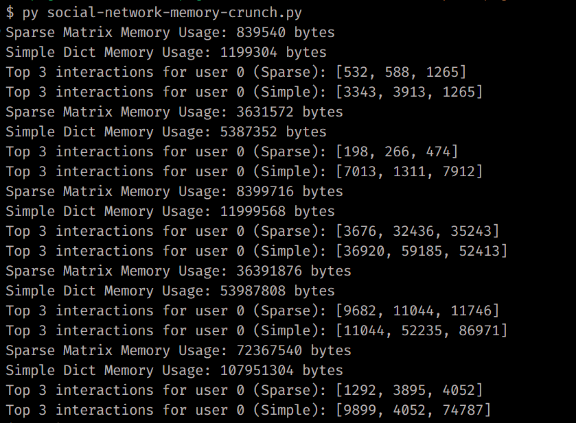

# Interaction Tracker

## Mathematical Approach

### Sparse Matrix Method

- A user interaction matrix of size `n_users x n_users` is created.
- Each cell `(i, j)` represents the number of interactions between user `i` and user `j`. If the interaction count is non-zero, it is stored, while empty interactions are not saved, thus saving memory.
- The top 3 most interacted users for any given user `i` are found by sorting the interaction values for row `i` of the matrix.

### Simple Dictionary Method

- A dictionary is used where the key is the user ID, and the value is another dictionary that stores interactions with other users.
- For each group interaction, the count of interactions between pairs of users is incremented.
- The top 3 most interacted users for a given user `i` are computed by sorting the dictionary values for user `i`.
